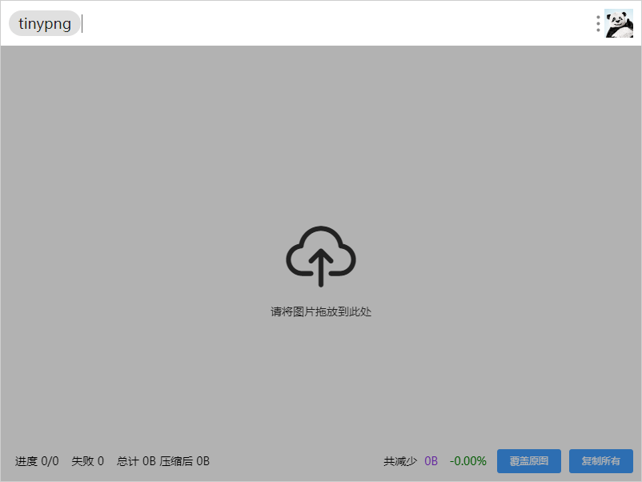
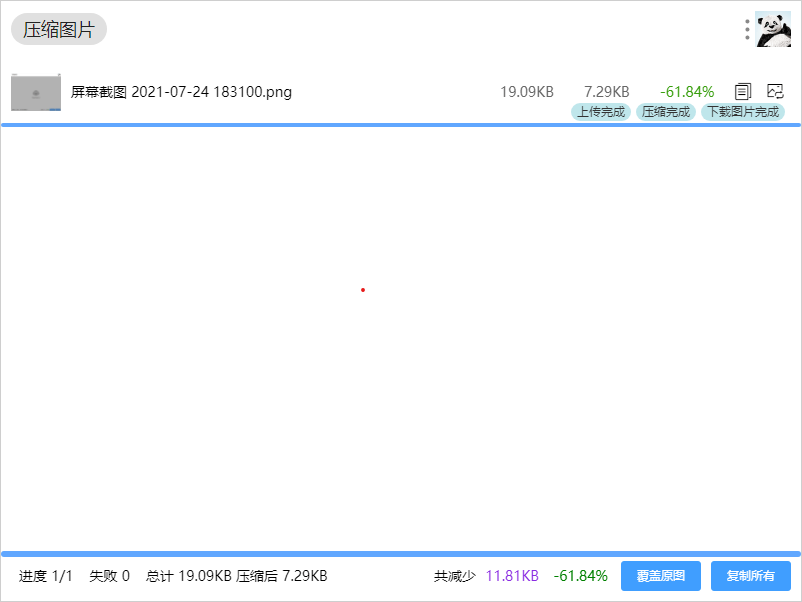

# utools 插件 `tinypng压缩图片`

## 仿照官方 `图片压缩` 重新实现 UI 及交互

> 利用 [https://tinypng.com/](https://tinypng.com/) web api 压缩图片 支持 png | jpg | webp

## 如何使用

下载 [utools](https://u.tools/) 搜索插件 `tinypng压缩图片`

## 版本记录

[See Releases](https://github.com/csj8520/utools-plugin-tinypng/releases)

### 2.0.0

- 仿照 `utools` 官方插件 `图片压缩` 重新实现 UI 及交互
- 支持取消
- 保留历史记录（退出插件后清除）
- 重新实现项目打包以及开发流程

### 1.1.5

- 支持深色模式
- 暂时屏蔽报错 `Error: read ECONNRESET`

### 1.1.4

- 支持 webp

### 1.1.3

- utools 2.0 兼容

### 1.1.2

- 修复 Mac, Linux 系统下下载图片失败问题

### 1.1.1

- 减少 preload 体积移除部分依赖包
- 删除: 代理模式

### 1.1.0

- 新增：支持文件夹下所有图片压缩
- ~~新增：配置代理模式，快捷键 ctrl+alt+shift+p~~
- 新增：支持超级面板打开
- 优化：异常提示
- 优化：上传、下载、错误处理

### 1.0.0

- 项目重构

### 0.0.4

- 优化上传速度
- 取消最多 20 个文件限制
